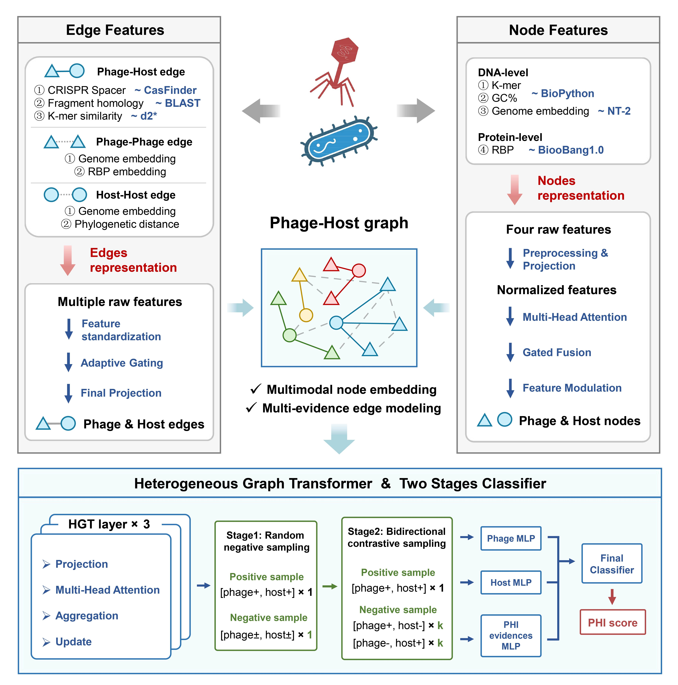

<div align="center">


</div>

- [GEM-PHI](#GEM-PHI)
  - [Description](#description)
  - [Installation](#installation)
    - [Clone the source code](#clone-the-source-code)
    - [Create the conda environment](#create-the-conda-environment)
    - [Prepare the pre-trained models](#prepare-the-pre-trained-models)
    - [Prepare the database](#prepare-the-database)
  - [Quick Start](#quick-start)
    - [Command Template](#command-template)
    - [Run Example](#run-example)
  - [GEM-PHI Design](#GEM-PHI-design)
  - [Evaluation Results](#evaluation-results)
  - [Citing this work](#citing-this-work)
  - [Author Contributions](#author-contributions)
  - [Contacts](#Contacts)


## Description

The **GEM-PHI (Graph-Embedded Multimodal learning for Phage-Host Interaction)** pipeline is a comprehensive toolkit for predicting phage-host relationships. It leverages a *Heterogeneous Graph Transformer (HGT)* model to integrate various genomic features, including nucleotide embeddings, protein-based features, and homology information, to provide accurate predictions of which phages infect which hosts. The pipeline is designed to be modular and efficient, handling large-scale genomic datasets by first calculating node and edge features in dedicated environments, then performing final inference to output a list of predicted interactions.


## Installation


### Clone the source code

```bash
git clone git@202.38.92.250:source-code/gem-phi.git
cd gem-phi
```


### Create the conda environment

The GEM-PHI pipeline uses three separate Conda environments for its different stages to manage dependencies effectively. The `environment` files are located in the environments directory.

```bash
conda env create -f environments/GEM-PHI.yml -n GEM-PHI_inference
conda env create -f environments/GEM-PHI_nodes.yml -n GEM-PHI_nodes
conda env create -f environments/GEM-PHI_edges.yml -n GEM-PHI_edges
```


### Prepare the pre-trained models

The pipeline requires several pre-trained models and external tools. You need to download them and update their paths in the config.yml file.

1. **Nucleotide Transformer Model**: Used for calculating nucleotide embeddings.
2. **RBP Detection Model**: Used to predict receptor-binding proteins in phages.
3. **Protein Embedding Model**: Used to calculate embeddings for the predicted RBPs.
4. **CRISPRCasFinder**: An external tool used for identifying CRISPR arrays and spacers in host genomes.

> The paths in your `config.yml` should be set to the corresponding locations within the `tools/` directory, similar to the following:
> ```yml
> paths:
>    nt_model_dir: 'tools/NT-500M'
>    rbp_detect_model_dir: 'tools/RBPdetect_v4_ESMfine'
>    rbp_embed_model_dir: 'tools/BiooBang/Bioobang1.0'
>    ccf_script: 'tools/CRISPRCasFinder/CRISPRCasFinder.pl'
>    ccf_so: 'tools/CRISPRCasFinder/sel392v2.so'
> ```


### Prepare the database

The pipeline uses reference databases for calculating certain features. You can download the required databases from our Zenodo repository.

1. **HGT Model Files**: The pre-trained HGT model, including the graph structure, node ID mappings, and normalization statistics.
2. **Reference Nodes**: A pickled file containing pre-calculated node features for a reference set of phages and hosts.
3. **Reference 16S rRNA**: A FASTA file containing 16S rRNA sequences for the reference hosts, used for phylogenetic similarity calculation.

> You can download the databases from our Zenodo link and set the `ref_nodes_file` and `ref_16s_file` paths in your `config.yml` file
> ```yml
> paths:
>    stats_path: '/your/path/to/GEM-PHI/db/graph/norm_stats_combined.pt'
>    graph_path: '/your/path/to/GEM-PHI/db/graph/Train_hetero.pt'
>    id_map_path: '/your/path/to/GEM-PHI/db/graph/id_maps.pt'
>
>    ref_nodes_file: '/your/path/to/GEM-PHI/db/reference_nodes.pkl'
>    ref_16s_file: '/your/path/to/GEM-PHI/db/reference_16s.fasta'
> ```


## Quick Start

The GEM-PHI pipeline consists of three main scripts for feature calculation and one script for orchestration. All scripts are located in the `bin/` directory.

1. `calculate_node_features.py`: This script is the first step of the pipeline. It takes host and phage FASTA files as input and computes a variety of node-level features, including GC content, k-mer frequency, nucleotide transformer embeddings, and RBP embeddings for phages. This script must be run in the `GEM-PHI_nodes` Conda environment.

2. `calculate_edge_features.py`: The second step, this script calculates features for the edges connecting the nodes. It computes phage-phage, host-host, and phage-host edge features based on similarities and homologies. This script must be run in the `GEM-PHI_edges` Conda environment.

3. `final_inference.py`: This is the final step, which loads the pre-trained GEM-PHI model and the calculated node and edge features to predict phage-host interactions. The script outputs a list of predicted interactions and their confidence scores. This script must be run in the `GEM-PHI_inference` Conda environment.

For a complete and automated run of the entire pipeline, use the `run_all.py` script. It orchestrates the execution of the three sub-scripts in their respective Conda environments.


### Command Template

```bash
python ./bin/run_all.py \
  --config_path [path_to_config.yml] \
  --host_fasta [path_to_host_fasta] \
  --phage_fasta [path_to_phage_fasta] \
  --output_dir [output_directory] \
  --num_workers [number_of_cpu_cores] \
  --device [device_id]
```


### Run Example

```bash
python ./bin/run_all.py \
  --config_path ./config.yml \
  --host_fasta ./examples/hosts.fasta \
  --phage_fasta ./examples/phages.fasta \
  --output_dir ./outputs/example_run \
  --num_workers 16 \
  --device 0
```

## GEM-PHI Design



## Evaluation Results

**GEM-PHI outperforms other quit tools!**


## Citing this work

***Persist to the end, and breakthroughs shall come!***


## Author Contributions

*Basspoom* led the project! 😏

Heng-rui Zhao was responsible for emotional support! 🥰

*Gorgeous Tabby* also responsible for emotional support! 😘🐈

*Basspoom* was responsible for the data processing framework, model training, and evaluation~ 🤗


## Contacts

We are honored to help you if you have any questions. Please feel free to open an issue or contact us directly. Hope our code helps and look forward to your citations.

[basspoom@mail.ustc.edu.cn] | [zhr123456@mail.ustc.edu.cn].

